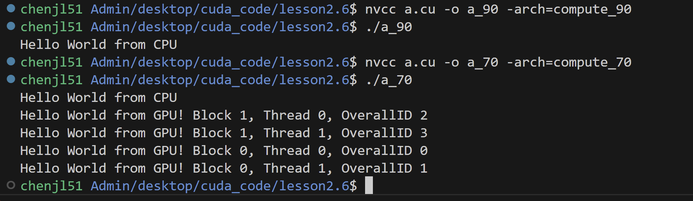
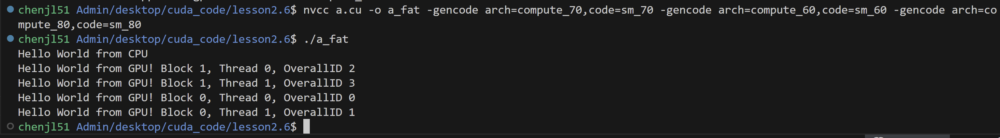
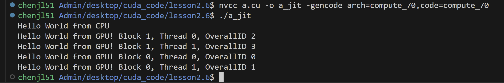

# Virtual architecture capabilities
```
nvcc a.cu -o a_AB -arch=compute_AB 
```


# Real architecture capabilities(CD must bigger than AB)
```
nvcc a.cu -o a_ABCD -arch=compute_AB -code=sm_CD
```

# Compile under multiple GPU version
```
nvcc a.cu -o a_fat -gencode arch=compute_AB,code=sm_AB -gencode arch=compute_CD,code=sm_CD -gencode arch=compute_EF,code=sm_EF
```


# nvcc Just-In-Time (JIT) Compilation
## To generate optimized machine code for the specific GPU at runtime.
```
nvcc a.cu -o a_jit -gencode arch=compute_AB,code=compute_AB
```



